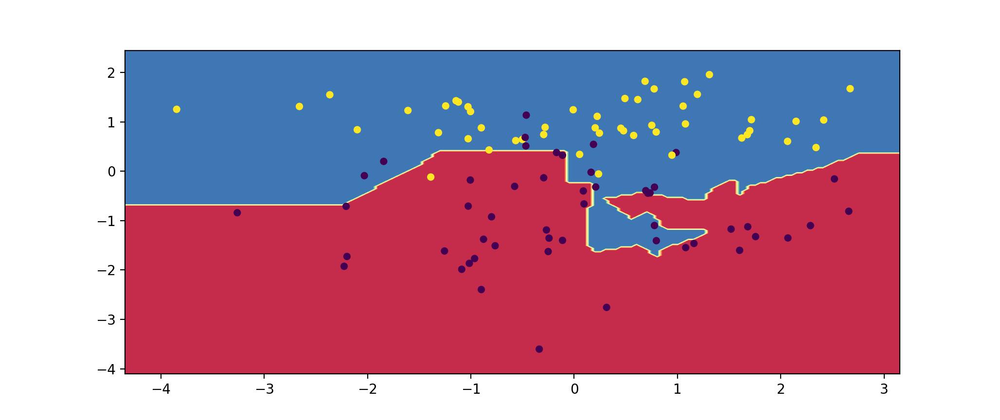
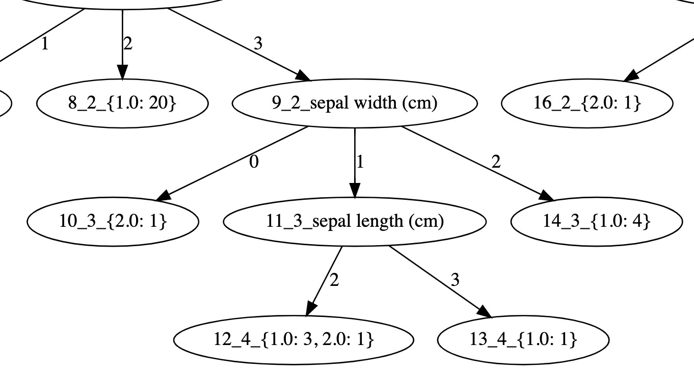
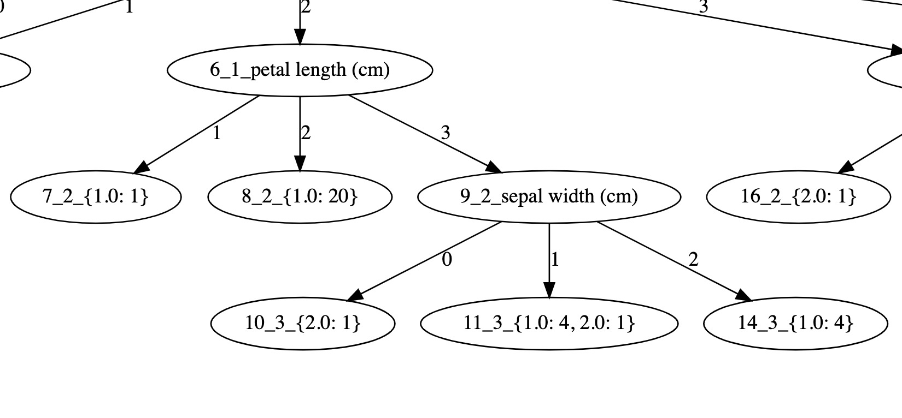
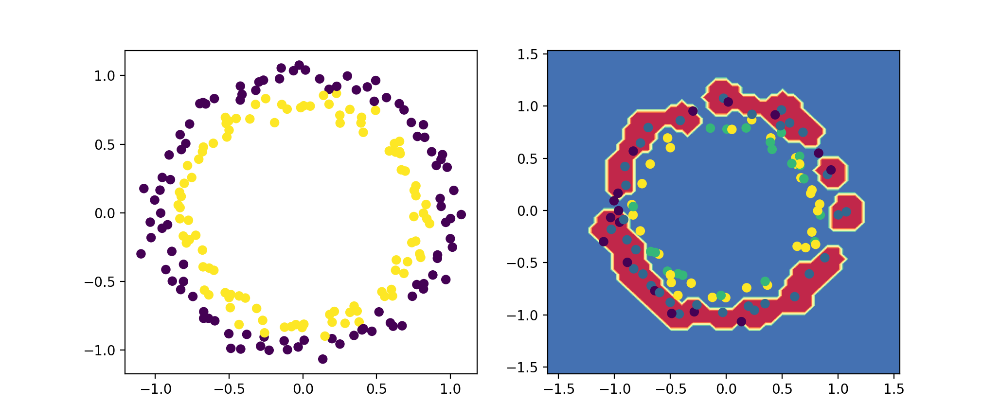

# 为什么实现本代码库

在读 **李航** 老师的 **《统计学习方法概论》** 时，看完一个算法，觉得自己懂了，可是，再一想细节，发现，还是很迷惑，因此，决定将书上的算法实现一遍，希望能够清楚算法原理以及在看书时忽略的细节。在真正实现完之后，发现之前看书真的忽略掉很多东西，跟着代码来看书能够理解的更深入。

**强烈建议**：对于希望弄清楚算法原理的同学，最好对着书上的原理看代码，并动手修改调试代码。

# 本代码库特点

+ 尽可能少的使用依赖库
+ 尽可能的实现书中涉及到的算法
+ 尽量采用较多的训练测试样本以贴近真实场景（HMM与CRF使用数据已放在data目录下，[数据来源](http://sighan.cs.uchicago.edu/bakeoff2005/)）
+ 尽力做到测试数据可视化

以下是一些可视化的例子：

+ KNN中测试数据分类面

  

  

+ 决策树

  + 剪枝前 

    
  
  + 剪枝后 
  
    

+ SVM径向基分类面

  

+ HMM分词结果

  我们  希望  ，  新  世纪  成为  各国  人民  共享  和平  的  世纪  。  在20世纪  里  ，  世界  饱受  各种  战争  和  冲突  的  苦难  。 

  北京  新年  音乐会  展现  经典  魅力  尉  健行  李  岚清  与  数千  首  都  观众  一起  欣赏  。 

  本届  冰雪节  第一  次  升格  为  国际  级  冰雪  盛会  ，  来  自20多  个  国家  的  使节  云集  冰城  ；  盛会  还  吸引  了  美国  、  日本  、  俄罗斯等国  的  冰雪  爱  好者  。 

# 依赖库版本

### 算法实现依赖

+ python          3.7.7
+ numpy           1.17.3 
+ pandas                    0.25.2

### 产生训练测试样本依赖

+ scikit-learn       0.23.1  

### 画图依赖

+ matplotlib        3.1.1
+ graphviz         2.40.1
